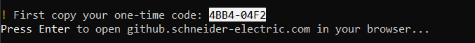
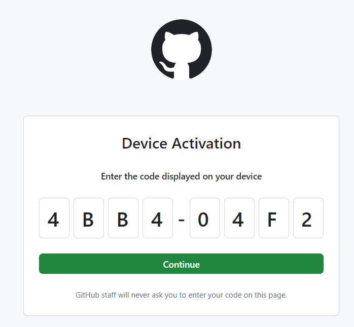
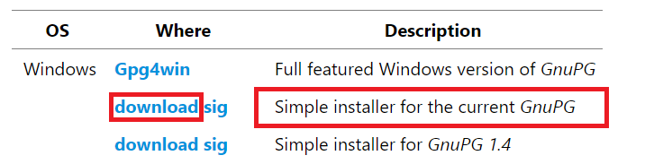

# Ansible Deployment for Ubuntu

Automated development environment setup for Ubuntu using Ansible. Works on both native Ubuntu installations and Windows Subsystem for Linux (WSL).

## What Gets Installed

| Category | Tools |
|----------|-------|
| **Container** | Docker |
| **Version Control** | Git (with SSH/GPG signing), GitHub CLI, Lazygit |
| **Shell** | Zsh, Oh-My-Zsh, Starship prompt, fzf |
| **Editor** | Neovim |
| **Terminal** | Tmux, Oh-My-Tmux, Tmuxifier, Alacritty |
| **Cloud/IaC** | AWS CLI, Terraform, SOPS |
| **Languages** | Rust (rustup), Python (uv), Node.js (NVM) |
| **CLI Tools** | bat, exa, fd, ripgrep, delta, procs, rip, tokei, topgrade, xcp, xh, zoxide |
| **Other** | OpenCode, neofetch, Stow |

## Roles

| Role | Description |
|------|-------------|
| [discover](roles/discover/README.md) | Environment detection and configuration validation |
| [base](roles/base/README.md) | System dependencies, Rust, and uv |
| [git](roles/git/README.md) | Git configuration with GPG signing and SSH |
| [shell](roles/shell/README.md) | Zsh with Oh-My-Zsh and plugins |
| [github](roles/github/README.md) | GitHub CLI installation |
| [cargo](roles/cargo/README.md) | Rust/Cargo CLI tools |
| [tools](roles/tools/README.md) | Developer tools (lazygit, neovim, tmux, etc.) |
| [dotfiles](roles/dotfiles/README.md) | Stow dotfiles to home directory |
| [docker](roles/docker/README.md) | Docker Engine installation |
| [common](roles/common/README.md) | Shared tasks (zshrc sourcing) |

## Quick Start (Ubuntu)

### Install Ansible dependencies

```Shell
sudo apt-get update && sudo apt-get install -y git python3 python3-pip ansible
```

### Clone the repository

```Shell
cd ${HOME} && git clone https://github.com/emrecanaltinsoy/stow-dotfiles && cd ${HOME}/stow-dotfiles/ansible/
```

### Configure Secrets

Create an encrypted vault file containing your secrets:

```Shell
cd ${HOME}/stow-dotfiles/ansible/ && EDITOR=<EDITOR_OF_CHOICE> ansible-vault create ${HOME}/stow-dotfiles/ansible/secrets.yml
```

Insert and update variables for your secrets.yml file:

```yaml
user_email: "email"
user_fullname: "Firstname Lastname"
user_passphrase: "passphrase_to_generate_new_gpg_key"
```

> [!CAUTION]  
> You need to remember this **Vault password** for every deployments and future updates.

### Deploy environment

```Shell
cd ${HOME}/stow-dotfiles/ansible/ && ansible-playbook setup.yml -i hosts --ask-become-pass --ask-vault-pass
```

> [!NOTE]  
> BECOME password: is your sudo password
>
> Vault password: is your password for your secrets.yml file

### Post-Install

After deployment, logout and login again to use Zsh as your default shell.

```Shell
source ${HOME}/.zshrc
```

> [!IMPORTANT]  
> If your Github account is not configured, you may see a request to authenticate yourself with Github:
> 
>
> Copy the code and press enter to open your web browser
>
> 
>
> Once you validate the code, your generated ssh key and gpg key will be automatically copied to your Github account.

---

## WSL Setup (Windows)

If you're setting up on Windows Subsystem for Linux, follow these additional steps first.


### Download and install Windows software

- [GPG](https://www.gnupg.org/download/index.html#binary)

> [!IMPORTANT]  
> Install 'Simple installer for the current version of GnuPG'
> 
>
> Do not install with **elevated rights**: If installer asks you to install with elevated rights, click on "Cancel", it will install with your user rights under your AppData directory.

### Install WSL

Open PowerShell:


```PowerShell
wsl --install --web-download --no-distribution
```

```PowerShell
wsl --update
```

```PowerShell
wsl.exe --set-default-version 2
```

### Install and launch Ubuntu 22.04


```PowerShell
wsl --install --web-download --distribution Ubuntu-22.04
```

You will be prompted to setup a username and a password (for sudo).


Open another PowerShell:

```PowerShell
wsl --set-default Ubuntu-22.04
```

### Open Ubuntu


```PowerShell
wsl --distribution Ubuntu-22.04
```


Now follow the [Quick Start](#quick-start-ubuntu) instructions above.

### Close all WSL distributions

```Shell
/mnt/c/Windows/system32/wsl.exe --shutdown
```

---

## Running on Remote Servers

You can deploy this configuration to remote Ubuntu servers by modifying the inventory file.

### Inventory File (hosts)

The `hosts` file defines which machines Ansible will target:

```ini
[local]
localhost ansible_host=127.0.0.1 ansible_connection=local

[servers]
server1 ansible_host=192.168.1.100 ansible_user=ubuntu
server2 ansible_host=192.168.1.101 ansible_user=ubuntu ansible_port=2222

[servers:vars]
ansible_ssh_private_key_file=~/.ssh/id_ed25519
```

### Common Inventory Variables

| Variable | Description |
|----------|-------------|
| `ansible_host` | IP address or hostname |
| `ansible_user` | SSH username |
| `ansible_port` | SSH port (default: 22) |
| `ansible_connection` | Connection type: `ssh`, `local`, `docker` |
| `ansible_ssh_private_key_file` | Path to SSH private key |

### Copy SSH Key to Remote Server

Before running Ansible, copy your SSH public key to the remote server:

```Shell
ssh-copy-id -i ~/.ssh/id_ed25519.pub ubuntu@192.168.1.100
```

This will prompt for the remote user's password and enable passwordless SSH authentication.

**Using a different port:**

```Shell
ssh-copy-id -i ~/.ssh/id_ed25519.pub -p 2222 ubuntu@192.168.1.100
```

**Verify connection:**

```Shell
ssh ubuntu@192.168.1.100
```

### Bootstrap Remote Servers (if Python is not installed)

Ansible requires Python on the remote host. If Python 3 is not installed, run the bootstrap playbook first:

```Shell
ansible-playbook bootstrap.yml -i hosts -l servers --ask-become-pass
```

This uses the `raw` module which doesn't require Python on the remote host.

### Deploy to Remote Servers

Run on all servers in a group:

```Shell
ansible-playbook setup.yml -i hosts -l servers --ask-become-pass --ask-vault-pass
```

Run on a single server:

```Shell
ansible-playbook setup.yml -i hosts -l server1 --ask-become-pass --ask-vault-pass
```

> [!NOTE]
> Make sure SSH access is configured before running the playbook.

---

## How to reduce the size of the WSL Disk

The disk file grows over time, but cleanup inside WSL does not automatically shrink the disk file.
If you need to reduce space in Windows, you can compact the WSL disk file.


Shutdown WSL and verify that all distributions are stopped:

```PowerShell
wsl --shutdown
wsl -l -v
```

Locate the vhdx path for your distro:

```PowerShell
"$env:USERPROFILE\AppData\Local\Packages\CanonicalGroupLimited.Ubuntu22.04LTS_*\LocalState\ext4.vhdx" | Resolve-Path
```

Open Diskpart:

```PowerShell
diskpart.exe
```

On the diskpart window, select the vhd by using previous path, and execute the command to compact the disk:

```
Select vdisk file="C:\Users\<USERNAME>\AppData\Local\Packages\CanonicalGroupLimited.Ubuntu22.04LTS_****\LocalState\ext4.vhdx"
detail vdisk
compact vdisk
detail vdisk
```

## License

MIT

## Testing

This project uses [Molecule](https://molecule.readthedocs.io/) for testing Ansible roles.

### Prerequisites

```bash
cd ansible
uv sync  # Install dependencies including molecule
```

### Running Tests

```bash
# Run full test suite (create, converge, idempotence, verify, destroy)
uv run molecule test

# Keep instance after test for debugging
uv run molecule test --destroy=never

# Run individual steps
uv run molecule create    # Create test container
uv run molecule converge  # Run playbook
uv run molecule verify    # Run verification tests
uv run molecule destroy   # Cleanup
```

### Test Configuration

- **Platform**: Ubuntu 22.04 (Docker)
- **Test variables**: Defined in `molecule/default/molecule.yml`
- **Verification**: `molecule/default/verify.yml` validates role outputs

## Author

Emrecan Altinsoy
